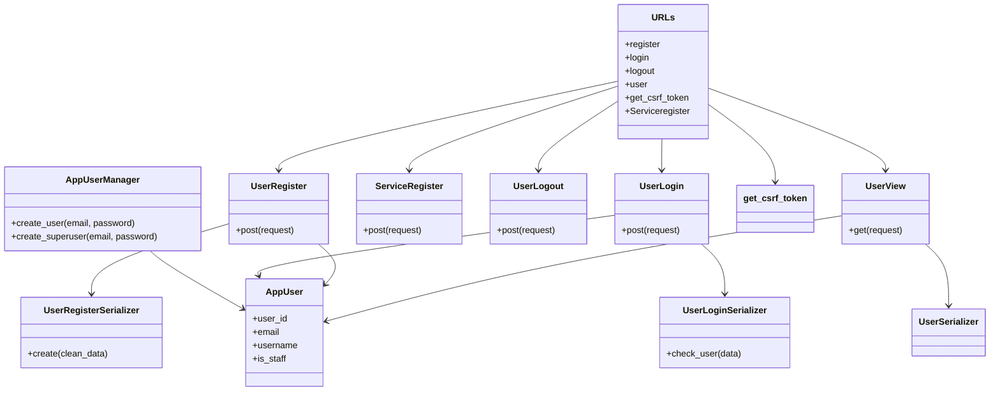

```mermaid
classDiagram
    class UserLoginSerializer {
        +check_user(data)
    }
    class UserRegisterSerializer {
        +create(clean_data)
    }
    class UserSerializer

    class UserLogin {
        +post(request)
    }
    class UserRegister {
        +post(request)
    }
    class ServiceRegister {
        +post(request)
    }
    class UserLogout {
        +post(request)
    }
    class UserView {
        +get(request)
    }
    class get_csrf_token

    class AppUserManager {
        +create_user(email, password)
        +create_superuser(email, password)
    }
    class AppUser {
        +user_id
        +email
        +username
        +is_staff
    }

    UserLogin --> UserLoginSerializer
    UserRegister --> UserRegisterSerializer
    UserView --> UserSerializer
    AppUserManager --> AppUser

    click UserLoginSerializer call linkCallback("home/lollo/Documents/challenge_fides/Back-End/login/my_login/serializers.py#L16")
    click UserRegisterSerializer call linkCallback("home/lollo/Documents/challenge_fides/Back-End/login/my_login/serializers.py#L6")
    click UserSerializer call linkCallback("home/lollo/Documents/challenge_fides/Back-End/login/my_login/serializers.py#L26")
    click UserLogin call linkCallback("home/lollo/Documents/challenge_fides/Back-End/login/my_login/views.py#L43")
    click UserRegister call linkCallback("home/lollo/Documents/challenge_fides/Back-End/login/my_login/views.py#L24")
    click ServiceRegister call linkCallback("home/lollo/Documents/challenge_fides/Back-End/login/my_login/views.py#L102")
    click UserLogout call linkCallback("home/lollo/Documents/challenge_fides/Back-End/login/my_login/views.py#L136")
    click UserView call linkCallback("home/lollo/Documents/challenge_fides/Back-End/login/my_login/views.py#L153")
    click get_csrf_token call linkCallback("home/lollo/Documents/challenge_fides/Back-End/login/my_login/views.py#L163")

    UserLogin --> AppUser
    UserRegister --> AppUser
    UserView --> AppUser

    class URLs {
        +register
        +login
        +logout
        +user
        +get_csrf_token
        +Serviceregister
    }

    URLs --> UserRegister
    URLs --> UserLogin
    URLs --> UserLogout
    URLs --> UserView
    URLs --> get_csrf_token
    URLs --> ServiceRegister
```
