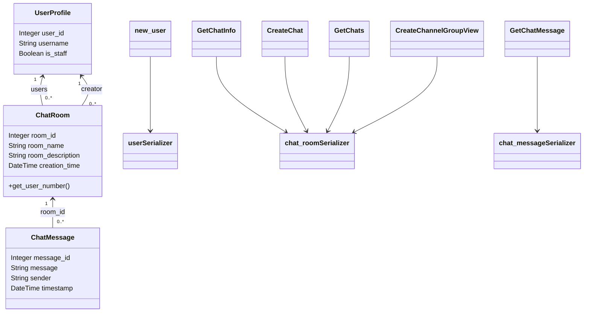

```mermaid
classDiagram
    class UserProfile {
        Integer user_id
        String username
        Boolean is_staff
    }
    class ChatRoom {
        Integer room_id
        String room_name
        String room_description
        DateTime creation_time
        +get_user_number()
    }
    class ChatMessage {
        Integer message_id
        String message
        String sender
        DateTime timestamp
    }
    class GetChatMessage
    class GetChatInfo
    class new_user
    class CreateChat
    class GetChats
    class CreateChannelGroupView
    class userSerializer
    class chat_roomSerializer
    class chat_messageSerializer

    UserProfile "1" <-- "0..*" ChatRoom : users
    UserProfile "1" <-- "0..*" ChatRoom : creator
    ChatRoom "1" <-- "0..*" ChatMessage : room_id

    GetChatMessage --> chat_messageSerializer
    GetChatInfo --> chat_roomSerializer
    new_user --> userSerializer
    CreateChat --> chat_roomSerializer
    GetChats --> chat_roomSerializer
    CreateChannelGroupView --> chat_roomSerializer

    click UserProfile call linkCallback("Back-End/chat/my_chat/models.py#L4")
    click ChatRoom call linkCallback("Back-End/chat/my_chat/models.py#L9")
    click ChatMessage call linkCallback("Back-End/chat/my_chat/models.py#L20")
    click GetChatMessage call linkCallback("Back-End/chat/my_chat/views.py#L15")
    click GetChatInfo call linkCallback("Back-End/chat/my_chat/views.py#L31")
    click new_user call linkCallback("Back-End/chat/my_chat/views.py#L45")
    click CreateChat call linkCallback("Back-End/chat/my_chat/views.py#L53")
    click GetChats call linkCallback("Back-End/chat/my_chat/views.py#L57")
    click CreateChannelGroupView call linkCallback("Back-End/chat/my_chat/views.py#L64")
    click userSerializer call linkCallback("Back-End/chat/my_chat/serializers.py#L3")
    click chat_roomSerializer call linkCallback("Back-End/chat/my_chat/serializers.py#L9")
    click chat_messageSerializer call linkCallback("Back-End/chat/my_chat/serializers.py#L29")
```
